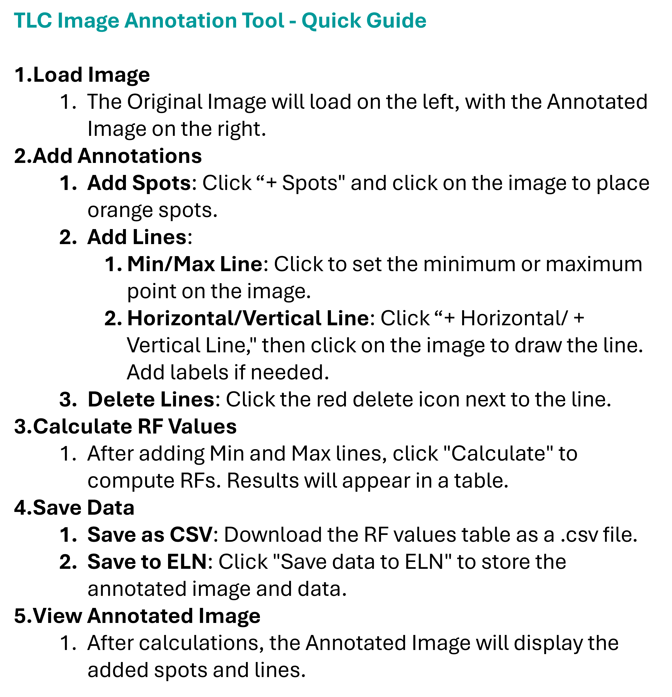

# AI TLC RF Calculator

AI TLC RF Calculator is a Django web application for Thin Layer Chromatography (TLC) image analysis. The app loads TLC plate images from an ELN image URL or a local upload, supports browser-based annotation, runs ONNX model inference for spot and line detection, calculates RF values, and produces annotated image and CSV outputs.



## Repository Information

```text
Repository name: ai-tlc-rf-calculator
Application folder: aitlcapp
Django project: rf_calculator
Django app: circle_detector
Primary page title: TLC Image Annotation Tool
```

## What This App Does

- Loads TLC images from an ELN-style URL passed through the page query string.
- Supports local TLC image upload with drag-and-drop or file selection.
- Displays the TLC image on a browser canvas for annotation.
- Adds and edits TLC spot markers.
- Adds Min and Max reference lines for RF calculation.
- Adds horizontal compound reference lines.
- Adds vertical mixture, solvent, or lane reference lines.
- Runs automatic Min/Max line detection using `line_best.onnx`.
- Runs automatic TLC spot detection using `spot_best.onnx`.
- Calculates RF values from spot position and Min/Max line geometry.
- Skips invalid RF values outside the `0.0` to `1.0` range.
- Draws annotated spots, RF values, compound labels, solvent labels, and reference lines on the output image.
- Exports RF result data as CSV.
- Provides browser actions to download CSV, save annotated image, and upload outputs back to the configured ELN endpoint.

## Application Workflow

1. Open the TLC annotation page.
2. Select **From ELN** or **Upload Local** as the image source.
3. For ELN mode, the app reads the `url` query parameter and fetches the image through `/fetch-image/`.
4. For local mode, the selected image is uploaded through `/upload-local-image/`.
5. Add Min and Max lines manually or use **Auto Detect Lines**.
6. Add TLC spots manually or use **Auto Detect Spots** after Min/Max lines are available.
7. Add horizontal and vertical annotation labels when needed.
8. Click **Calculate RF**.
9. Review the RF table and annotated TLC image.
10. Export the CSV or annotated image.

## Tech Stack

| Area | Technology |
|---|---|
| Backend framework | Django `>=3.2,<4.0` |
| Runtime image | Python `3.9` Docker base image |
| HTTP server | Gunicorn `20.1.0` |
| Static dependency | WhiteNoise `6.6.0` |
| HTTP client | Requests `2.32.3` |
| Computer vision | OpenCV Headless `4.6.0.66` |
| Numerical processing | NumPy `1.26.4` |
| Image handling | Pillow `10.2.0` |
| ONNX inference | ONNX Runtime `1.19.2` |
| ML utilities | scikit-learn `1.2.2`, Matplotlib `3.7.1` |
| Frontend | HTML, CSS, JavaScript |
| UI libraries | Materialize CSS, SweetAlert2, Google Material Icons |
| Database | SQLite by default |

## Project Structure

```text
aitlcapp/
├── circle_detector/
│   ├── images/
│   │   └── initial-quick-guide.png
│   ├── migrations/
│   │   └── __init__.py
│   ├── ml_models/
│   │   ├── __init__.py
│   │   ├── line_best.onnx
│   │   └── spot_best.onnx
│   ├── static/
│   │   └── images/
│   │       └── initial-quick-guide.png
│   ├── templates/
│   │   └── circle_detector/
│   │       ├── annotate.html
│   │       ├── result.html
│   │       └── upload.html
│   ├── __init__.py
│   ├── admin.py
│   ├── apps.py
│   ├── line_onnx.py
│   ├── models.py
│   ├── spot_onnx.py
│   ├── tests.py
│   ├── urls.py
│   └── views.py
├── rf_calculator/
│   ├── __init__.py
│   ├── asgi.py
│   ├── settings.py
│   ├── urls.py
│   └── wsgi.py
├── static/
├── .dockerignore
├── .gitattributes
├── Dockerfile
├── manage.py
└── requirements.txt
```

## ONNX Model Files

The app loads both ONNX models during Django startup:

```text
circle_detector/ml_models/spot_best.onnx
circle_detector/ml_models/line_best.onnx
```

Current model configuration from `rf_calculator/settings.py`:

```python
SPOT_MODEL_PATH = BASE_DIR / "circle_detector" / "ml_models" / "spot_best.onnx"
SPOT_IMGSZ_DEFAULT = 1280
SPOT_CONF_DEFAULT = 0.15
TLC_BAND_MARGIN = 12

LINE_MODEL_PATH = BASE_DIR / "circle_detector" / "ml_models" / "line_best.onnx"
LINE_IMGSZ_DEFAULT = 1024
LINE_CONF_DEFAULT = 0.05
```

Model file sizes in the uploaded app package:

```text
line_best.onnx: about 12 MB
spot_best.onnx: about 44 MB
```

## RF Calculation Logic

The backend calculates RF values in `circle_detector/views.py` using the spot position and selected reference lines:

```python
rf_value = (spot_y - min_line_y) / (max_line_y - min_line_y)
rf_value = round(rf_value, 2)
```

Only RF values strictly between `0.0` and `1.0` are included in the CSV and response.

The CSV columns generated by the app are:

```text
Solvent (X value), Compound (Y value), RF value
```

The frontend download CSV action uses these column names:

```text
mixture_label (X axis), substance_label (Y axis), RF value
```

## API Endpoints

| Method | Endpoint | Function |
|---|---|---|
| GET | `/` | Opens the TLC annotation interface. |
| POST | `/upload-local-image/` | Uploads a local TLC image to `media/local_uploads/`. |
| GET | `/fetch-image/?url=...` | Downloads an ELN/remote image and stores it as `media/downloaded_image.png`. |
| GET | `/serve-image/?file_path=...` | Serves an image file path back to the browser. |
| POST | `/auto_detect_lines/` | Runs `line_best.onnx` and returns Min/Max line positions. |
| POST | `/auto_detect_spots/` | Runs `spot_best.onnx` inside the Min/Max band and returns detected spot centers. |
| POST | `/calculate_rf/` | Calculates RF values and creates annotated image plus CSV files. |
| GET | `/admin/` | Django admin route. |

## Endpoint Payloads

### Auto Detect Lines

```json
{
  "isLocalImage": true,
  "imageSrc": "local_upload.png",
  "imageData": "data:image/png;base64,...",
  "localImagePath": "local_uploads/image.png"
}
```

Example response:

```json
{
  "minY": 120.5,
  "maxY": 740.2,
  "debug": {
    "image_size": [1024, 768],
    "conf": 0.05,
    "raw_detections": 2
  }
}
```

### Auto Detect Spots

```json
{
  "isLocalImage": true,
  "imageSrc": "local_upload.png",
  "imageData": "data:image/png;base64,...",
  "localImagePath": "local_uploads/image.png",
  "minY": 120.5,
  "maxY": 740.2
}
```

Example response:

```json
{
  "spots": [
    {
      "x": 300.4,
      "y": 420.8,
      "conf": 0.86
    }
  ],
  "debug": {
    "image_size": [1024, 768],
    "roi": [0, 108, 1024, 752],
    "minY": 120.5,
    "maxY": 740.2,
    "kept": 1
  }
}
```

### Calculate RF

```json
{
  "lines": [
    {"type": "min", "y": 700},
    {"type": "max", "y": 100},
    {"type": "vertical", "x": 300, "text": "Mixture A"},
    {"type": "horizontal", "y": 420, "text": "Compound A"}
  ],
  "spots": [
    {"x": 300, "y": 420}
  ],
  "imageSrc": "downloaded_image.png",
  "isLocalImage": false,
  "canvasWidth": 1024,
  "canvasHeight": 768,
  "scaleFactor": 1
}
```

Example response:

```json
{
  "rf_values": [
    {
      "compound": "Compound A",
      "solvent": "Mixture A",
      "rf": 0.47
    }
  ],
  "annotated_image_url": "/media/annotated_downloaded_image_1772283241.png",
  "csv_url": "/media/rf_values_downloaded_image_1772283241.csv",
  "message": "Successfully calculated RF values for 1 spots"
}
```

## Local Setup

### 1. Clone the repository

```bash
git clone https://github.com/shilpa2806/ai-tlc-rf-calculator.git
cd ai-tlc-rf-calculator
```

### 2. Create a virtual environment

Windows:

```powershell
python -m venv venv
venv\Scripts\activate
```

macOS/Linux:

```bash
python3 -m venv venv
source venv/bin/activate
```

### 3. Install dependencies

```bash
python -m pip install --upgrade pip
pip install -r requirements.txt
```

### 4. Set local environment variables

Windows PowerShell:

```powershell
$env:SECRET_KEY="django-insecure-local-development-ai-tlc-rf-calculator"
$env:DEBUG="True"
$env:ALLOWED_HOSTS="localhost,127.0.0.1,172.22.211.68"
```

macOS/Linux:

```bash
export SECRET_KEY="django-insecure-local-development-ai-tlc-rf-calculator"
export DEBUG="True"
export ALLOWED_HOSTS="localhost,127.0.0.1,172.22.211.68"
```

### 5. Apply migrations

```bash
python manage.py migrate
```

### 6. Run the development server

```bash
python manage.py runserver
```

Local URL:

```text
http://127.0.0.1:8000/
```

## Docker Setup

Build the Docker image:

```bash
docker build -t ai-tlc-rf-calculator .
```

Run the Docker container:

```bash
docker run --rm -p 8050:8050 \
  -e SECRET_KEY="django-insecure-local-development-ai-tlc-rf-calculator" \
  -e DEBUG="False" \
  -e ALLOWED_HOSTS="localhost,127.0.0.1" \
  ai-tlc-rf-calculator
```

Docker URL:

```text
http://localhost:8050/
```

The included Dockerfile uses:

```text
FROM python:3.9
WORKDIR /code
EXPOSE 8050
CMD gunicorn rf_calculator.wsgi:application --bind 0.0.0.0:8050
```

## Environment Variables

| Variable | Used In | Purpose |
|---|---|---|
| `SECRET_KEY` | `rf_calculator/settings.py` | Django cryptographic signing key. |
| `DEBUG` | `rf_calculator/settings.py` | Enables or disables Django debug mode. |
| `ALLOWED_HOSTS` | `rf_calculator/settings.py` | Comma-separated host allowlist. |

Default values currently present in the uploaded app:

```python
DEBUG=True
ALLOWED_HOSTS=localhost,127.0.0.1,172.22.211.68
```

## GitHub Push Commands

```bash
git init
git branch -M main
git add .
git commit -m "Initial commit"
git remote add origin https://github.com/shilpa2806/ai-tlc-rf-calculator.git
git push -u origin main
```

If the remote already exists:

```bash
git remote set-url origin https://github.com/shilpa2806/ai-tlc-rf-calculator.git
git push -u origin main
```

## Files to Keep Out of Git

The uploaded app package contains runtime and generated files. These should stay out of GitHub:

```text
.git/
db.sqlite3
media/
staticfiles/
__pycache__/
*.pyc
.env
venv/
```

Recommended `.gitignore`:

```gitignore
# Python
__pycache__/
*.py[cod]
*.pyo
*.pyd

# Virtual environments
venv/
.venv/
env/

# Django
db.sqlite3
staticfiles/
media/

# Environment
.env
.env.*

# OS and editor files
.DS_Store
Thumbs.db
.vscode/
.idea/
```

## Production Readiness Notes

The current app is ready for GitHub and can run with Django or Docker. For public production deployment, the following operational items should be completed:

- Set `DEBUG=False`.
- Generate and set a secure `SECRET_KEY` in the hosting environment.
- Set `ALLOWED_HOSTS` to the deployed domain.
- Add `whitenoise.middleware.WhiteNoiseMiddleware` or serve static files through a web server/CDN.
- Move from SQLite to PostgreSQL or another managed database for multi-user usage.
- Use persistent media storage for uploaded TLC images, annotated images, and generated CSV files.
- Restrict `/fetch-image/` to trusted ELN or image-host domains.
- Avoid exposing absolute server file paths through `/serve-image/`.
- Remove `csrf_exempt` from POST endpoints or protect them with the final authentication flow.
- Add authentication before exposing the app outside a private lab or ELN network.
- Run `python manage.py check --deploy` before go-live.

## Troubleshooting

### ONNX model loading error

Check that both model files exist:

```text
circle_detector/ml_models/spot_best.onnx
circle_detector/ml_models/line_best.onnx
```

### No spots detected

- Draw Min and Max lines first.
- Verify the TLC spots are inside the Min/Max band.
- Review `SPOT_CONF_DEFAULT` in `rf_calculator/settings.py`.

### No lines detected

- Use a clearer TLC image.
- Review `LINE_CONF_DEFAULT` in `rf_calculator/settings.py`.

### No RF values returned

- Confirm that at least one spot is between the Min and Max lines.
- RF values outside `0.0` and `1.0` are skipped.
- Confirm that canvas width and height are passed in the `/calculate_rf/` payload.

## License


## Maintainer

Shilpa Thotli
